# ScreenSpot-TRM: UI Grounding with Tiny Recursive Models

A neural network framework for **GUI element grounding** that maps natural language instructions to bounding boxes on screenshots. Built on the [Tiny Recursive Model (TRM)](https://arxiv.org/abs/2510.04871) architecture from Samsung Research, enhanced with insights from the [UI-Ins paper](https://arxiv.org/abs/2510.20286) on multi-perspective reasoning.

<p align="center">
  
  
  
</p>

---

## 🎯 What is UI Grounding?

Given a screenshot and a natural language instruction like *"Click the submit button"*, the model predicts the bounding box `[x1, y1, x2, y2]` of the target UI element.

```mermaid
flowchart LR
    subgraph Input
        IMG[📱 Screenshot]
        TXT["🗣️ Click submit button"]
    end
    
    subgraph Model["ScreenSpot-TRM"]
        ENC[VisionText Encoder]
        TRM[Recursive Reasoning]
        HEAD[Policy Head]
    end
    
    subgraph Output
        BBOX["📍 [0.42, 0.75, 0.58, 0.82]"]
    end
    
    IMG --> ENC
    TXT --> ENC
    ENC --> TRM
    TRM --> HEAD
    HEAD --> BBOX
```



---

## 🏗️ Architecture

### High-Level Overview

```mermaid
flowchart TB
    subgraph Input["📥 Input"]
        IMAGE["🖼️ Screenshot<br/>(B, C, H, W)"]
        TEXT["📝 Instruction<br/>(B, L)"]
    end
    
    subgraph Encoder["🔍 VisionTextEncoder"]
        direction TB
        VIS["Vision Encoder<br/>(SigLIP)"]
        TXT_ENC["Text Encoder"]
        VIS_EMB["vision_embeds<br/>(B, N_v, H)"]
        TXT_EMB["text_embeds<br/>(B, N_t, H)"]
        
        VIS --> VIS_EMB
        TXT_ENC --> TXT_EMB
    end
    
    subgraph TRM["🔄 TinyRecursiveModel"]
        direction TB
        INIT["Initialize States"]
        ZH["z_H: Semantic State<br/>(text-biased)"]
        ZL["z_L: Spatial State<br/>(vision-biased)"]
        LOOP["Recursive Loop<br/>H_cycles × L_cycles"]
        HALT{"ACT:<br/>Halt?"}
        
        INIT --> ZH
        INIT --> ZL
        ZH --> LOOP
        ZL --> LOOP
        LOOP --> HALT
    end
    
    subgraph Heads["🎯 Output Heads"]
        POLICY["PolicyHead<br/>→ BBox (B, 4)"]
        VALUE["ValueHead<br/>→ V(s) (B, 1)"]
    end
    
    IMAGE --> VIS
    TEXT --> TXT_ENC
    VIS_EMB --> INIT
    TXT_EMB --> INIT
    HALT -->|Final State| POLICY
    HALT -->|Final State| VALUE
```



### Dual-State Recursive Reasoning (Core Innovation)

The TRM uses **two interacting latent states** that enable multi-perspective reasoning:


### Key Design Principles

| Principle | Implementation | Benefit |
|-----------|---------------|---------|
| **Dual States** | `z_H` (semantic) + `z_L` (spatial) | Multi-perspective reasoning |
| **Input Injection** | Context added every L-cycle | Keeps model grounded to visual input |
| **Deep Supervision** | Loss on all H-cycle outputs | Faster convergence |
| **Adaptive Halting** | Q-learning based stopping | Efficiency for "easy" samples |
| **SwiGLU MLP** | Gated linear units | More expressive than GELU |

---

## 📊 Multi-Perspective Reasoning (UI-Ins Inspired)

The dual-state architecture maps naturally to multi-perspective reasoning:

```mermaid
graph TB
    subgraph Instruction["📝 Instruction: 'Click submit'"]
        direction LR
    end
    
    subgraph ZH["🧠 z_H (Semantic State)"]
        INTENT["💭 Intent<br/>'submit form'"]
        FUNCTION["⚙️ Function<br/>'sends data'"]
    end
    
    subgraph ZL["👁️ z_L (Spatial State)"]
        APPEAR["🎨 Appearance<br/>'blue button'"]
        LOCATION["📍 Location<br/>'bottom-right'"]
    end
    
    Instruction --> ZH
    Instruction --> ZL
    
    INTENT <-->|"interact"| APPEAR
    FUNCTION <-->|"interact"| LOCATION
    
    ZH -->|"H-cycle update"| BBOX["🎯 BBox Prediction"]
    ZL -->|"spatial info"| ZH
    
    style ZH fill:#e3f2fd
    style ZL fill:#fff8e1
```



| UI-Ins Perspective | TRM State | Initialization |
|-------------------|-----------|----------------|
| Intent, Function | `z_H` (semantic) | Text-biased |
| Appearance, Location | `z_L` (spatial) | Vision-biased |

---

## 🚀 Quick Start

### Installation

```bash
git clone https://github.com/yourusername/screenspot-trm.git
cd screenspot-trm

python -m venv .venv
source .venv/bin/activate

pip install -r requirements.txt
```

### Dataset Preparation

```bash
# Pre-tokenize the dataset (optional but faster training)
python dataset_prep/preprocess.py \
    --input_path dataset/screenspot_training.parquet \
    --output_path dataset/screenspot_tokenized.parquet \
    --model_name google/siglip-base-patch16-256-multilingual
```

### Training

```bash
# Basic training with ACT
python train.py \
    --data_path dataset/screenspot_tokenized.parquet \
    --model_name google/siglip-base-patch16-256-multilingual \
    --batch_size 32 \
    --epochs 50 \
    --lr 1e-4 \
    --H_cycles 3 \
    --L_cycles 6 \
    --use_act \
    --max_steps 5 \
    --use_wandb
```

### Inference

```python
from models.agent import InfoMaxAgent
import torch

agent = InfoMaxAgent(
    vision_text_model="google/siglip-base-patch16-256-multilingual",
    H_cycles=3, L_cycles=6
)
agent.load_state_dict(torch.load("checkpoint.pt")["model_state_dict"])
agent.eval()

with torch.no_grad():
    bbox = agent.get_final_prediction(image, input_ids, attention_mask)
    # bbox: [x1, y1, x2, y2] normalized to [0,1]
```

---

## ⚙️ Training Arguments

| Argument | Default | Description |
|----------|---------|-------------|
| `--data_path` | `dataset/screenspot_training.parquet` | Path to dataset |
| `--model_name` | `google/siglip-so400m-patch14-384` | Vision-language backbone |
| `--batch_size` | `8` | Training batch size |
| `--epochs` | `1` | Number of training epochs |
| `--lr` | `1e-4` | Learning rate |
| `--H_cycles` | `3` | High-level reasoning cycles |
| `--L_cycles` | `6` | Low-level refinement cycles |
| `--use_act` | `False` | Enable adaptive halting |
| `--max_steps` | `10` | Maximum steps for ACT |
| `--skip_rl` | `False` | Skip RL training phase |
| `--use_wandb` | `False` | Enable W&B logging |

---

## 📈 Training Pipeline

```mermaid
flowchart TB
    subgraph Epoch["📅 For Each Epoch"]
        direction TB
        
        subgraph Phase1["🎓 Phase 1: Supervised Training"]
            SUP_LOSS["Loss = L1 + GIoU + ACT"]
            DEEP["Deep supervision on<br/>ALL H-cycle outputs"]
            GRAD["Gradient clipping<br/>(max_norm=1.0)"]
        end
        
        subgraph Phase2["🎮 Phase 2: Advantage-Weighted RL"]
            RL_ADV["Advantage Weighting:<br/>Focus on hard samples"]
            RL_CONFIDENCE["Value Head → Uncertainty<br/>(usable at inference!)"]
            RL_LOSS["Loss = L1 + weighted GIoU + Value"]
        end
        
        subgraph Phase3["✅ Phase 3: Validation"]
            VAL_METRICS["Metrics: IoU, Loss, Steps"]
        end
        
        SAVE["💾 Save Checkpoint"]
        
        Phase1 --> Phase2
        Phase2 --> Phase3
        Phase3 --> SAVE
    end
    
    style Phase1 fill:#e8f5e9
    style Phase2 fill:#fff3e0
    style Phase3 fill:#e3f2fd
```



### RL Phase Improvements

The RL training phase uses **advantage-weighted learning** to provide benefits beyond supervised training:

| Feature | Description | Benefit |
|---------|-------------|---------|
| **Advantage Weighting** | Samples where model underperformed get stronger gradients | Focuses learning on hard examples |
| **Uncertainty Estimation** | Value Head predicts `1 - IoU` instead of reward | **Confidence scores at inference!** |
| **L1 Loss Restored** | Full coordinate-level signal | Same strength as supervised |

### Inference with Confidence

After training with the RL phase, you can get confidence scores:

```python
# Standard prediction (bbox only)
bbox = agent.get_final_prediction(image, input_ids, attention_mask)

# Prediction with confidence (NEW!)
bbox, confidence = agent.predict_with_confidence(image, input_ids, attention_mask)
# confidence: 0.0-1.0, higher = more confident
print(f"Prediction confidence: {confidence.item():.1%}")
```

---

## 📁 Project Structure

```
screenspot-trm/
├── models/
│   ├── trm.py           # TinyRecursiveModel (dual-state, ACT)
│   ├── agent.py         # InfoMaxAgent (full pipeline)
│   ├── encodings.py     # VisionTextEncoder (SigLIP/CLIP)
│   └── policy.py        # BBoxPolicyHead, ValueHead
├── training/
│   ├── trainer.py       # Trainer (supervised + RL)
│   └── rewards.py       # IoU, GIoU, reward functions
├── data_loader/
│   └── screenspot.py    # Dataset loader
├── dataset_prep/
│   └── preprocess.py    # Pre-tokenization script
├── train.py             # Main training script
└── README.md
```

---

## 🔬 Research Background

### Tiny Recursive Models (Samsung Research)

> **"Less is More: Recursive Reasoning with Tiny Networks"** ([arXiv:2510.04871](https://arxiv.org/abs/2510.04871))

7M parameter model achieving 45% on ARC-AGI-1 through recursive reasoning with weight sharing.

### UI-Ins: Instruction-as-Reasoning (Alibaba)

> **"UI-Ins: Enhancing GUI Grounding with Multi-Perspective Instruction-as-Reasoning"** ([arXiv:2510.20286](https://arxiv.org/abs/2510.20286))

94% accuracy on ScreenSpot-V2 by treating instructions as multiple analytical perspectives.

---

## 📝 License

MIT License - see [LICENSE](LICENSE) for details.

## 🙏 Acknowledgments

- [Samsung Research - TinyRecursiveModels](https://github.com/SamsungSAILMontreal/TinyRecursiveModels)
- [Alibaba - UI-Ins](https://github.com/alibaba/UI-Ins)
- [HuggingFace Transformers](https://github.com/huggingface/transformers)
